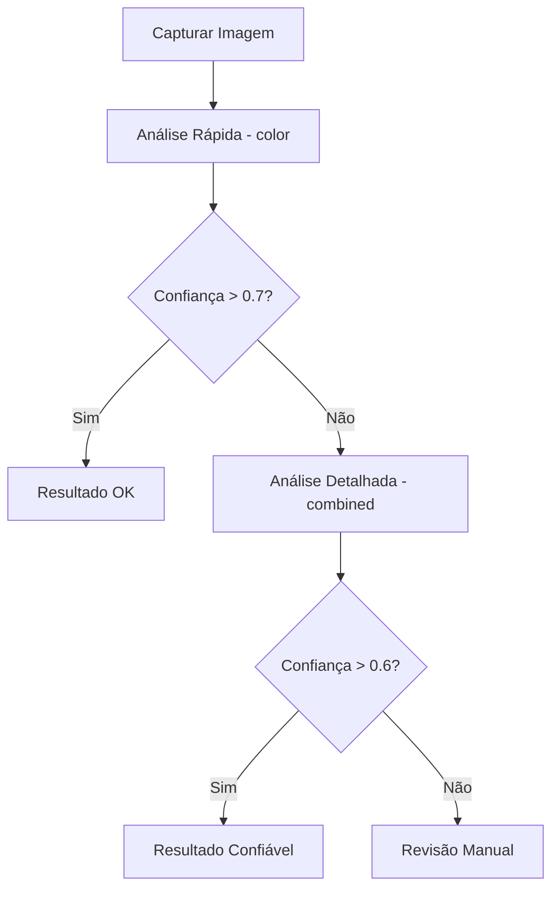

# 🌟 Guia de Melhores Práticas

Este guia apresenta as melhores práticas para uso eficiente e seguro do Sistema de Detecção de Mato Alto.

## 📋 Índice

- [Preparação de Imagens](#-preparação-de-imagens)
- [Escolha do Método](#-escolha-do-método)
- [Configuração Otimizada](#-configuração-otimizada)
- [Performance](#-performance)
- [Qualidade dos Resultados](#-qualidade-dos-resultados)
- [Automação](#-automação)
- [Segurança](#-segurança)
- [Manutenção](#-manutenção)

## 📸 Preparação de Imagens

### Qualidade da Imagem

```bash
# ✅ BOM: Imagem bem iluminada, foco nítido
python3 src/main.py --image boa_qualidade.jpg --method combined

# ❌ EVITE: Imagens muito escuras, borradas ou saturadas
```

### Diretrizes de Captura

**📐 Resolução Recomendada**
- **Mínima**: 640x480
- **Ideal**: 1280x720 a 1920x1080
- **Máxima processável**: 4K (será redimensionada automaticamente)

**🌅 Condições de Iluminação**
- **Melhor horário**: 10h-15h (sol alto)
- **Evitar**: Nascer/pôr do sol, sombras fortes
- **Tempo nublado**: Aceitável, pode precisar ajuste de contraste

**📏 Ângulo e Distância**
```
✅ IDEAL:
- Ângulo: 30-60° da vertical
- Distância: 2-10 metros do alvo
- Altura: 1.5-3 metros do solo

❌ EVITAR:
- Ângulo muito baixo (< 15°)
- Muito próximo (< 1 metro)
- Muito alto (> 20 metros)
```

### Pré-processamento

```python
# Exemplo de preparação de imagem
from PIL import Image, ImageEnhance
import cv2

def preparar_imagem(caminho_entrada, caminho_saida):
    # Carregar imagem
    img = Image.open(caminho_entrada)
    
    # Ajustar tamanho se muito grande
    if max(img.size) > 2048:
        img.thumbnail((2048, 2048), Image.Resampling.LANCZOS)
    
    # Melhorar contraste se necessário
    enhancer = ImageEnhance.Contrast(img)
    img = enhancer.enhance(1.2)
    
    # Salvar
    img.save(caminho_saida, quality=90)
    
    return caminho_saida

# Usar
imagem_preparada = preparar_imagem("original.jpg", "preparada.jpg")
```

## 🎯 Escolha do Método

### Guia de Seleção

| Cenário | Método Recomendado | Justificativa |
|---------|-------------------|---------------|
| **Análise rápida** | `color` | Velocidade máxima |
| **Uso geral** | `combined` | Melhor precisão |
| **Vegetação densa** | `texture` | Detecta padrões complexos |
| **Cenários variados** | `combined` | Adapta-se automaticamente |
| **Produção** | `combined` | Balanceio ideal |

### Exemplos Práticos

```bash
# 🏃 Análise rápida para triagem
python3 src/main.py --image lote/*.jpg --method color --batch

# 🎯 Análise precisa para decisões importantes
python3 src/main.py --image area_critica.jpg --method combined

# 🔍 Análise detalhada para documentação
python3 src/main.py --image relatorio.jpg --method combined --output relatorios/
```

### Fluxo de Trabalho Recomendado



## ⚙️ Configuração Otimizada

### Configuração Base (config.json)

```json
{
  "detection": {
    "min_confidence": 0.6,
    "consensus_threshold": 0.7,
    "adaptive_threshold": true,
    "default_method": "combined"
  },
  "performance": {
    "num_threads": "auto",
    "parallel_processing": {
      "enable": true,
      "batch_size": 4
    }
  },
  "output": {
    "save_original": false,
    "save_mask": true,
    "save_overlay": true,
    "save_stats": true
  }
}
```

### Configurações por Cenário

**🏠 Uso Residencial**
```json
{
  "detection": {
    "min_confidence": 0.5,
    "default_method": "color"
  },
  "color_analysis": {
    "brightness_threshold": 0.25,
    "adaptive_ranges": true
  }
}
```

**🏢 Uso Comercial/Institucional**
```json
{
  "detection": {
    "min_confidence": 0.7,
    "default_method": "combined"
  },
  "validation": {
    "scenario_detection": {
      "enable": true
    },
    "consensus_validation": {
      "enable": true,
      "min_agreement": 0.8
    }
  }
}
```

**🔬 Pesquisa Científica**
```json
{
  "detection": {
    "min_confidence": 0.8,
    "default_method": "combined"
  },
  "output": {
    "save_original": true,
    "save_mask": true,
    "save_overlay": true,
    "save_stats": true
  },
  "logging": {
    "level": "DEBUG"
  }
}
```

## ⚡ Performance

### Otimização de Velocidade

```bash
# ✅ Configurações para velocidade máxima
export GRASS_DETECTOR_FAST_MODE=true

# Usar método mais rápido
python3 src/main.py --image foto.jpg --method color

# Processamento paralelo em lote
python3 src/main.py --batch pasta/ --method color --output saida/
```

### Monitoramento de Performance

```python
import time
from src.detector import GrassDetector

def benchmark_metodos(imagem_path):
    detector = GrassDetector()
    metodos = ['color', 'texture', 'combined']
    
    resultados = {}
    
    for metodo in metodos:
        inicio = time.time()
        resultado = detector.detect_image(imagem_path, method=metodo)
        tempo = time.time() - inicio
        
        resultados[metodo] = {
            'tempo': tempo,
            'cobertura': resultado['coverage'],
            'confianca': resultado['confidence']
        }
        
        print(f"{metodo}: {tempo:.3f}s, {resultado['coverage']:.1f}%, {resultado['confidence']:.2f}")
    
    return resultados
```

### Otimização de Memória

```bash
# Limitar uso de memória
export GRASS_DETECTOR_MEMORY_LIMIT=2G

# Processar imagens grandes em chunks
python3 src/main.py --image imagem_4k.jpg --method combined --max-size 1920x1080
```

## 🎯 Qualidade dos Resultados

### Interpretação de Scores de Confiança

```python
def interpretar_resultado(resultado):
    confianca = resultado['confidence']
    cobertura = resultado['coverage']
    flags = resultado.get('scenario_flags', [])
    
    if confianca >= 0.8:
        status = "🟢 ALTA CONFIANÇA"
        acao = "Resultado confiável, pode usar diretamente"
    elif confianca >= 0.6:
        status = "🟡 CONFIANÇA MÉDIA"
        acao = "Bom resultado, verificar contexto se crítico"
    elif confianca >= 0.4:
        status = "🟠 CONFIANÇA BAIXA"
        acao = "Recomenda-se verificação manual"
    else:
        status = "🔴 CONFIANÇA MUITO BAIXA"
        acao = "Repetir análise ou usar outro método"
    
    print(f"Status: {status}")
    print(f"Ação recomendada: {acao}")
    print(f"Cobertura detectada: {cobertura:.1f}%")
    
    if flags:
        print(f"Flags de cenário: {', '.join(flags)}")
    
    return status
```

### Validação Cruzada

```bash
# Comparar métodos para validação
python3 src/main.py --image area_importante.jpg --method color
python3 src/main.py --image area_importante.jpg --method combined

# Usar menu para comparação visual
python3 src/main.py
# Selecionar opção "5. Comparar métodos"
```

### Calibração para Seu Ambiente

```python
# Exemplo de calibração personalizada
def calibrar_para_regiao(imagens_exemplo):
    detector = GrassDetector()
    
    # Testar diferentes configurações
    configs = [
        {'brightness_threshold': 0.2, 'contrast_threshold': 0.3},
        {'brightness_threshold': 0.3, 'contrast_threshold': 0.4},
        {'brightness_threshold': 0.4, 'contrast_threshold': 0.5}
    ]
    
    melhor_config = None
    melhor_score = 0
    
    for config in configs:
        detector.update_config(config)
        scores = []
        
        for img in imagens_exemplo:
            resultado = detector.detect_image(img, method='combined')
            scores.append(resultado['confidence'])
        
        score_medio = sum(scores) / len(scores)
        
        if score_medio > melhor_score:
            melhor_score = score_medio
            melhor_config = config
    
    print(f"Melhor configuração: {melhor_config}")
    print(f"Score médio: {melhor_score:.3f}")
    
    return melhor_config
```

## 🤖 Automação

### Scripts de Automação

**📁 Processamento em Lote**
```bash
#!/bin/bash
# processo_lote.sh

PASTA_ENTRADA=$1
PASTA_SAIDA=$2
METODO=${3:-combined}

echo "Processando imagens de $PASTA_ENTRADA..."

source venv/bin/activate

# Criar pasta de saída
mkdir -p "$PASTA_SAIDA"

# Processar todas as imagens
for img in "$PASTA_ENTRADA"/*.{jpg,jpeg,png,JPG,JPEG,PNG}; do
    if [[ -f "$img" ]]; then
        echo "Processando: $(basename "$img")"
        python3 src/main.py \
            --image "$img" \
            --method "$METODO" \
            --output "$PASTA_SAIDA"
    fi
done

echo "Processamento concluído!"
```

**⏰ Agendamento com Cron**
```bash
# Adicionar ao crontab (crontab -e)

# Processar imagens diariamente às 2h
0 2 * * * /caminho/para/projeto/processo_lote.sh /entrada /saida combined

# Limpeza semanal de logs
0 0 * * 0 find /caminho/para/projeto/logs -name "*.log" -mtime +7 -delete
```

**🔄 Monitoramento de Pasta**
```python
import time
import os
from watchdog.observers import Observer
from watchdog.events import FileSystemEventHandler
from src.detector import GrassDetector

class ProcessadorImagem(FileSystemEventHandler):
    def __init__(self):
        self.detector = GrassDetector()
    
    def on_created(self, event):
        if not event.is_directory and event.src_path.lower().endswith(('.jpg', '.jpeg', '.png')):
            print(f"Nova imagem detectada: {event.src_path}")
            time.sleep(2)  # Aguardar upload completo
            
            resultado = self.detector.detect_image(event.src_path, method='combined')
            
            if resultado['confidence'] >= 0.7:
                print(f"✅ Processada: {resultado['coverage']:.1f}% cobertura")
            else:
                print(f"⚠️ Baixa confiança: {resultado['confidence']:.2f}")

# Usar
observer = Observer()
observer.schedule(ProcessadorImagem(), '/pasta/monitorada', recursive=False)
observer.start()
```

### API REST (Exemplo)

```python
from flask import Flask, request, jsonify
from src.detector import GrassDetector
import base64
import io
from PIL import Image

app = Flask(__name__)
detector = GrassDetector()

@app.route('/detect', methods=['POST'])
def detect_grass():
    try:
        # Receber imagem em base64
        data = request.json
        image_data = base64.b64decode(data['image'])
        image = Image.open(io.BytesIO(image_data))
        
        # Salvar temporariamente
        temp_path = '/tmp/temp_image.jpg'
        image.save(temp_path)
        
        # Processar
        method = data.get('method', 'combined')
        resultado = detector.detect_image(temp_path, method=method)
        
        # Retornar resultado
        return jsonify({
            'success': True,
            'coverage': resultado['coverage'],
            'confidence': resultado['confidence'],
            'confidence_level': resultado['confidence_level'],
            'scenario_flags': resultado.get('scenario_flags', [])
        })
        
    except Exception as e:
        return jsonify({'success': False, 'error': str(e)}), 500

if __name__ == '__main__':
    app.run(host='0.0.0.0', port=5000)
```

## 🔒 Segurança

### Proteção de Dados

```bash
# ✅ Práticas seguras

# 1. Não commitar imagens sensíveis
echo "*.jpg" >> .gitignore
echo "*.png" >> .gitignore
echo "output/" >> .gitignore

# 2. Usar variáveis de ambiente para configurações
export GRASS_DETECTOR_API_KEY="sua_chave_aqui"
export GRASS_DETECTOR_OUTPUT_DIR="/local/seguro"

# 3. Limitar permissões
chmod 700 output/
chmod 600 config.json
```

### Validação de Entrada

```python
def validar_imagem(caminho):
    """Validar imagem antes do processamento"""
    try:
        # Verificar se arquivo existe
        if not os.path.exists(caminho):
            raise ValueError("Arquivo não encontrado")
        
        # Verificar tamanho
        tamanho = os.path.getsize(caminho)
        if tamanho > 50 * 1024 * 1024:  # 50MB
            raise ValueError("Arquivo muito grande")
        
        # Verificar formato
        with Image.open(caminho) as img:
            if img.format not in ['JPEG', 'PNG', 'JPG']:
                raise ValueError("Formato não suportado")
        
        return True
        
    except Exception as e:
        print(f"Erro de validação: {e}")
        return False
```

### Logs de Auditoria

```python
import logging
from datetime import datetime

# Configurar logging de auditoria
audit_logger = logging.getLogger('audit')
handler = logging.FileHandler('logs/audit.log')
formatter = logging.Formatter('%(asctime)s - %(message)s')
handler.setFormatter(formatter)
audit_logger.addHandler(handler)
audit_logger.setLevel(logging.INFO)

def registrar_processamento(imagem, metodo, resultado):
    """Registrar processamento para auditoria"""
    audit_logger.info(f"PROCESSAMENTO: {imagem}, método: {metodo}, "
                     f"cobertura: {resultado['coverage']:.1f}%, "
                     f"confiança: {resultado['confidence']:.2f}")
```

## 🔧 Manutenção

### Limpeza Regular

```bash
#!/bin/bash
# limpeza.sh - Script de manutenção

echo "🧹 Iniciando limpeza do sistema..."

# Limpar arquivos temporários
find /tmp -name "grass_detector_*" -mtime +1 -delete

# Limpar logs antigos
find logs/ -name "*.log" -mtime +30 -delete

# Limpar saídas antigas (opcional)
read -p "Limpar outputs antigos (>30 dias)? (y/N): " -n 1 -r
if [[ $REPLY =~ ^[Yy]$ ]]; then
    find output/ -type f -mtime +30 -delete
fi

# Verificar espaço em disco
df -h | grep -E "(/$|/home)"

echo "✅ Limpeza concluída!"
```

### Atualizações

```bash
#!/bin/bash
# atualizar.sh

echo "🔄 Atualizando sistema..."

# Fazer backup da configuração
cp config.json config.json.backup

# Ativar ambiente virtual
source venv/bin/activate

# Atualizar dependências
pip install --upgrade pip
pip install --upgrade -r requirements.txt

# Executar testes
python3 -c "
import sys
sys.path.append('src')
from detector import GrassDetector
detector = GrassDetector()
print('✅ Sistema funcionando após atualização')
"

echo "✅ Atualização concluída!"
```

### Monitoramento de Saúde

```python
def verificar_saude_sistema():
    """Verificar saúde geral do sistema"""
    problemas = []
    
    # Verificar espaço em disco
    import shutil
    espaco_livre = shutil.disk_usage('.').free / (1024**3)  # GB
    if espaco_livre < 1:
        problemas.append("Pouco espaço em disco")
    
    # Verificar dependências
    try:
        import cv2, numpy, sklearn
    except ImportError as e:
        problemas.append(f"Dependência faltando: {e}")
    
    # Verificar diretórios
    for dir_name in ['output', 'logs', 'models']:
        if not os.path.exists(dir_name):
            problemas.append(f"Diretório faltando: {dir_name}")
    
    if problemas:
        print("⚠️ Problemas encontrados:")
        for p in problemas:
            print(f"  - {p}")
    else:
        print("✅ Sistema em bom estado")
    
    return len(problemas) == 0
```

## 📊 Métricas e Relatórios

### Relatório de Uso

```python
def gerar_relatorio_uso():
    """Gerar relatório de uso do sistema"""
    import json
    from datetime import datetime, timedelta
    
    # Ler logs de auditoria
    relatorio = {
        'periodo': str(datetime.now().date()),
        'total_imagens': 0,
        'metodos_utilizados': {},
        'confianca_media': 0,
        'tempo_total': 0
    }
    
    # Processar logs e gerar estatísticas
    # ... código de processamento ...
    
    # Salvar relatório
    with open(f'relatorios/uso_{datetime.now().strftime("%Y%m%d")}.json', 'w') as f:
        json.dump(relatorio, f, indent=2)
    
    print(f"📊 Relatório salvo: relatorios/uso_{datetime.now().strftime('%Y%m%d')}.json")
```

---

## 🎯 Resumo das Melhores Práticas

### ✅ FAÇA
- Usar imagens de boa qualidade (resolução adequada, bem iluminadas)
- Escolher método apropriado para seu cenário
- Configurar sistema para seu ambiente específico
- Monitorar scores de confiança
- Fazer backup de configurações importantes
- Implementar logs de auditoria para uso profissional
- Manter sistema atualizado
- Validar entrada antes do processamento

### ❌ NÃO FAÇA
- Processar imagens muito escuras ou borradas
- Ignorar flags de cenário problemático
- Usar sempre o mesmo método sem considerar o contexto
- Deixar arquivos temporários acumularem
- Expor dados sensíveis em logs
- Ignorar atualizações de segurança
- Processar arquivos sem validação

### 🚀 PARA PRODUÇÃO
- Configurar monitoramento automatizado
- Implementar retry em caso de falhas
- Usar processamento em paralelo para lotes
- Configurar rotação de logs
- Implementar cache para melhor performance
- Ter plano de backup e recuperação

---

**Seguindo estas práticas, você terá o melhor desempenho e confiabilidade do Sistema de Detecção de Mato Alto! 🌿**